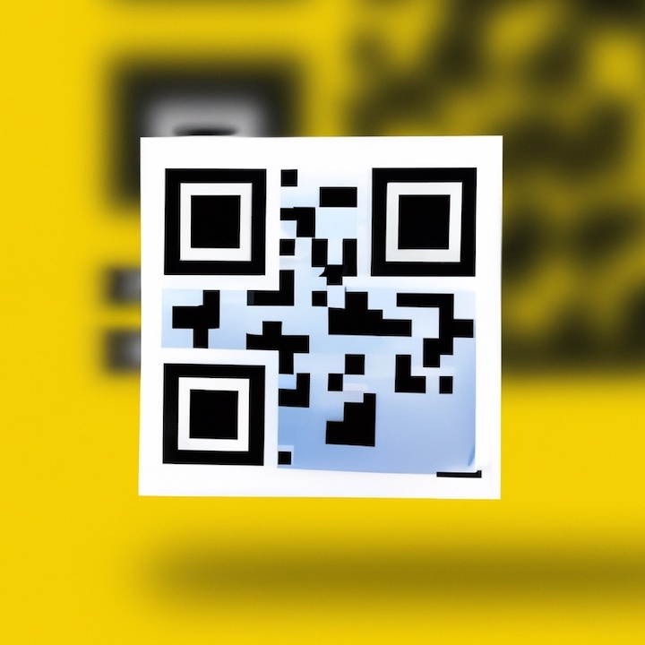
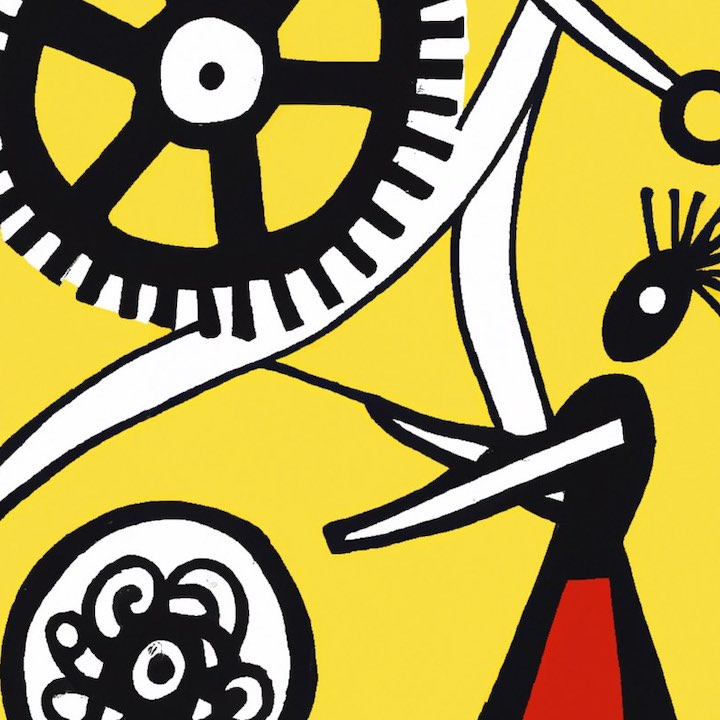

  

    

      
    

    

      

        <h6>Built using p5.js and RNBO, released under the GPL-3.0 license.  </h6>
      

      
The project is open-source and accessible to anyone interested in experimenting with code, providing a powerful tool for anyone looking to push the boundaries of music creation and listening.  

   

  

  

    

      
    

    

      

        <h6>Cards use NFC chips with assocciated NFT and ENT Music Player. </h6>
      

      
ENTs exist in both the physical and digital worlds, and are connected with a certificate of authenticity, creating a system where different parts of the worlds coexist at the same time, but are still part of the same system.  

    

  

 

  

    

      
    

    

      

        <h6>QR Techonoly.     </h6>
      

      
       QR can be added to physical card as speciall requeriment to widness the access.      

   

  

  

    

      
    

    

      

        <h6> Harmony between artisanship and automation.  </h6>
      

      
 We propose to use these technologies to support projects that expand our possibilities as human creators instead of gradually dehumanizing the creative process. We believe it is interesting what a creative mind can do with these tools, not the other way around. Thus transitioning from the era of "tools used by humans" to the era of tools that walk with humans. 

    

  

 

  

    

      
    

    

      

        <h6> 100% Eco Friendly Papers And Inks    </h6>
      

      
   FSC certified papers and food-grade inks from the best European suppliers that are 100% recyclable.   

   

  

  

    

      
    

    

      

        <h6> 100% ecologically produced in Italy with Solar Energy Powered Production. </h6>
      

      
 In constant search of sustainability, we we partener a company that use rigorously selected topnotch printing and packaging machinery powered by the greenest choices in energy and process management.  

    

  

